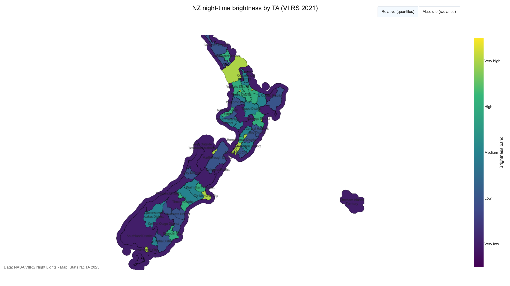
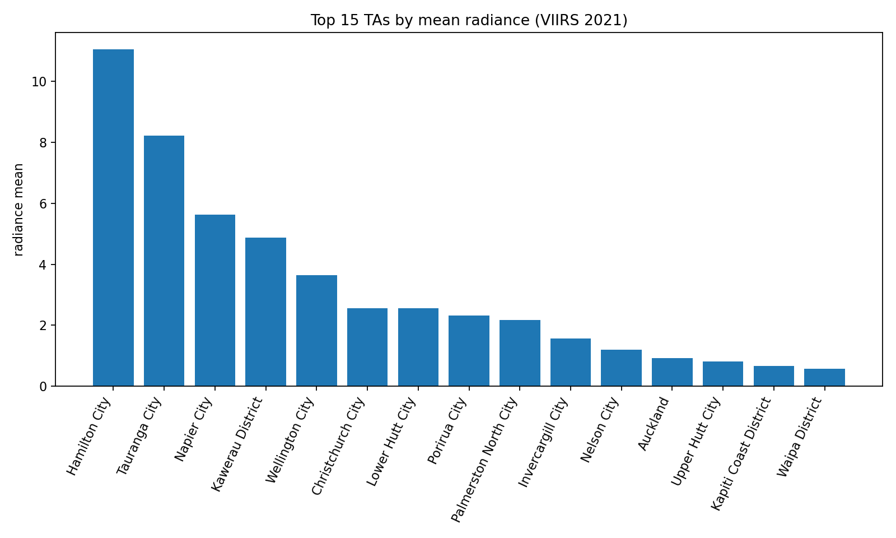
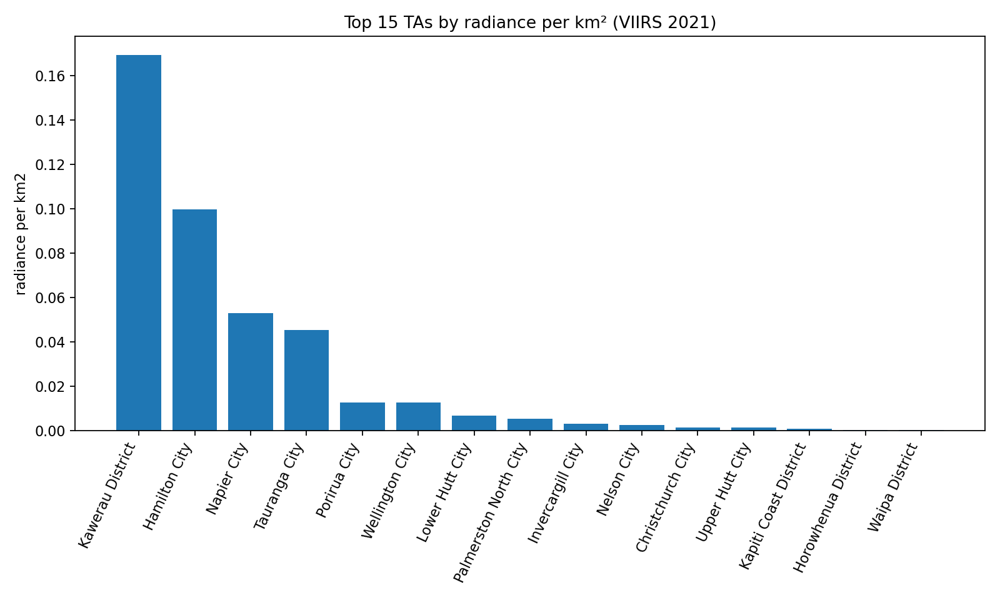

# 🌃 NZ Night-time Brightness by Territorial Authority (VIIRS 2021)

This project maps and ranks average night-time **radiance** across New Zealand’s Territorial Authorities (TAs) using NASA’s **VIIRS Night Lights** (2021). It includes both an **interactive choropleth** and static charts.

**Live map:** 👉 **[Open Interactive Map](https://vivekr25.github.io/light-nz-alan-health/)**



---

## Key findings (first pass)

- **Overall mean radiance (absolute):**  
  **Hamilton City** ranks highest, followed by **Tauranga** and **Napier**.  
  This reflects **total light output over each TA** (urban extent + intensity).

- **Radiance per km² (density):**  
  **Kawerau District** tops the list, then **Hamilton City** and **Napier City**.  
  Density highlights **concentrated lighting** (e.g., industrial sites or compact urban cores), not just large urban area.

- **Why Hamilton > Auckland on the absolute chart?**  
  Our metric is **TA-average radiance**, not total lumens. Hamilton’s urban area is compact and consistently bright, which pushes up its mean. Auckland’s very large TA includes darker rural/coastal areas that **dilute** the mean.

### Top 15: absolute mean radiance


### Top 15: radiance per km² (density)


---

## What’s in the repo

- `data_proc/viirs_ta_annual_2021_with_names.csv` – TA-level radiance with names  
- `data_proc/ta_single_map_toggle.html` – interactive choropleth  
- `data_proc/ta_brightness_map_1600.png` – static map image  
- `data_proc/top15_abs_radiance.png` – bar chart (absolute mean)  
- `data_proc/top15_radiance_per_km2.png` – bar chart (density)

---

## Reproduce locally

```bash
conda activate alan-nz
python scripts/31_single_map_toggle.py        # builds map + PNG
python scripts/36_normalize_and_rank.py       # builds normalized CSV
python scripts/37_make_normalized_charts.py   # builds the two charts

## Data & credits
	•	VIIRS Night Lights (2021) – NASA/NOAA
	•	Administrative boundaries – Stats NZ, TA 2025
	•	Processing & visualization – Python, Pandas, Plotly.
