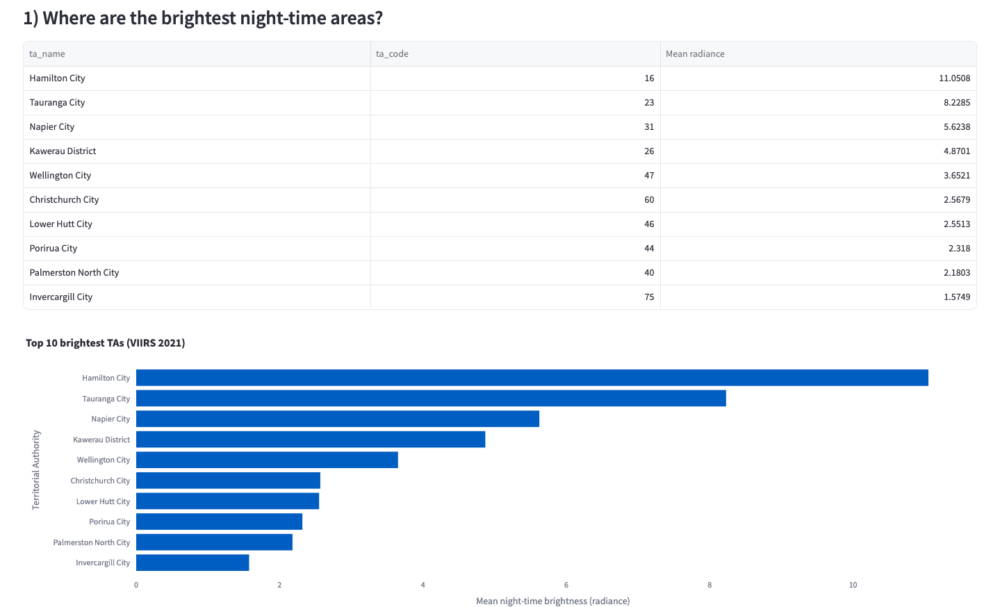
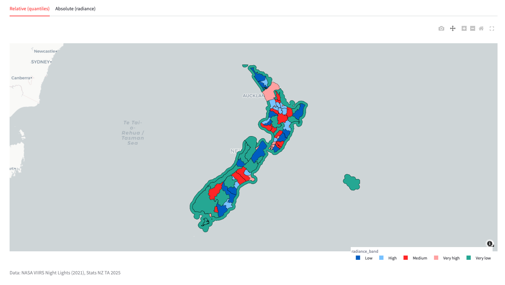
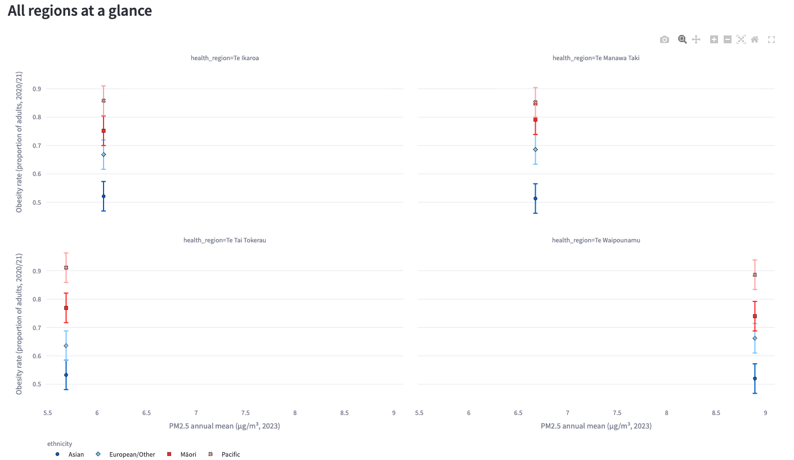

# Alan-NZ: Environment × Health in Aotearoa

🔗 **Live app:** https://light-nz-alan-health.streamlit.app/

## Screenshots

### Key insights
A small set of headline findings derived from publicly available
environmental and health datasets across Aotearoa New Zealand.

*Top 10 brightest Territorial Authorities based on VIIRS night time
radiance (2021).*

### Night-time brightness (VIIRS 2021)

*NZ Wide relative night time brightness by TA based on VIIRS night time radiance (2021)

### Equity lens: PM₂.₅ × Obesity

*PM₂.₅ vs obesity by ethnicity within health regions”*

An interactive data exploration of how **environmental factors**
(night-time light and air quality) relate to **health outcomes** across Aotearoa New Zealand.

## Why this project exists

Public health outcomes are shaped by more than healthcare alone.
This project explores how **environmental exposure** and
**built-environment proxies** vary across regions, and how these
patterns intersect with **health and equity indicators**.

The goal is **exploratory insight**, not causal claims.

## What you can explore

- 🌃 **Night-time brightness** by Territorial Authority (VIIRS, 2021)
- 🌬️ **PM₂.₅ and PM₁₀ air pollution** annual means by region (LAWA)
- ⚖️ **Health × environment comparisons**, including obesity
- 🧭 **Equity lens** views by ethnicity, deprivation, and region
- ✨ A **Key insights** page summarising headline findings

## Headline insights

- Night time brightness is strongly concentrated in major urban
  Territorial Authorities, reflecting built environment intensity.
- Regional air pollution levels vary meaningfully year-to-year,
  with PM₂.₅ patterns differing from PM₁₀.
- Within regions, obesity prevalence differs by ethnicity and often
  overlaps with higher pollution exposure and deprivation.
- These patterns highlight **structural and environmental context**
  rather than individual level causation.

  ## Limitations & interpretation notes

- **Observational analysis only**  
  This project explores associations and patterns in aggregated data.
  It does **not** establish causal relationships between environment and health.

- **Aggregated geography**  
  Most analyses are performed at Territorial Authority or health-region level.
  Local variation within regions may be masked.

- **Proxy measures**  
  Night-time light intensity is used as a proxy for built-environment
  activity and urbanisation, not individual behaviour or exposure.

- **Temporal alignment**  
  Data sources span different years (e.g. VIIRS 2021, obesity 2020/21,
  air quality 2023). Results should be interpreted as broad structural
  patterns rather than point-in-time comparisons.

- **Environmental exposure ≠ personal exposure**  
  Regional air-quality averages do not capture individual-level exposure,
  mobility, indoor environments, or duration of exposure.

  ## Data sources

- **NASA VIIRS Night Lights** (2021)
- **Stats NZ** Territorial Authority boundaries (TA 2025)
- **LAWA** air quality monitoring data (2016–2024)
- **Ministry of Health (NZ)** obesity prevalence (2020/21)

All data is publicly available and used for non-commercial,
exploratory analysis.

## Project structure
light-nz-alan-health/
├── streamlit_app/        # Streamlit application
├── data_raw/             # Raw input datasets (selected files tracked)
├── data_proc/            # Processed / derived datasets
├── scripts/              # Data processing & merge scripts
├── docs/                 # Optional figures / exports
└── README.md

## Run locally

```bash
git clone https://github.com/vivekr25/light-nz-alan-health.git
cd light-nz-alan-health/streamlit_app
pip install -r requirements.txt
streamlit run app.py

## Limitations

- Observational analysis only (no causal inference)
- Aggregated regional data may mask local variation
- Environmental exposure is a proxy, not a direct measure
- Data years differ slightly across sources

## Next improvements

- Add air-quality choropleth maps
- Convert large Excel inputs to parquet for performance
- Expand health outcomes beyond obesity
- Add temporal trend comparisons

